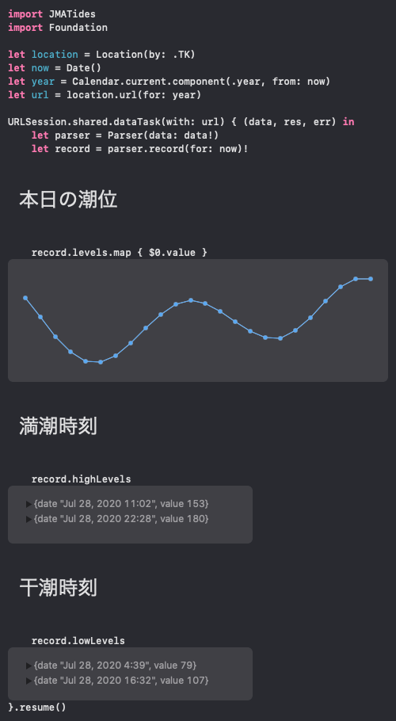

# JMATides

日本国気象庁の提供する、[潮位表データ] のパースを行う Swift ライブラリ

A Swift Library to parse Tide Table Data published by Japan Meteorological Agency.

ref: [潮位表フォーマット](https://www.data.jma.go.jp/gmd/kaiyou/db/tide/suisan/readme.html#TXT)

[](./Examples/Fetch.swift)

## Usage

```swift
// Package.swift
package.dependencies = [
    .package(name: "JMATides", url: "https://github.com/ngs/jma-tides-swift", from: "0.0.0")
]
```

## Teste on Playground

Use [arena]

```sh
arena https://github.com/ngs/jma-tides-swift --name JMATidesPlayground

curl https://github.com/ngs/jma-tides-swift/raw/master/Examples/Fetch.swift > \
  JMATidesPlayground/MyPlayground.playground/Contents.swift 
```

## Author

[Atsushi Nagase]

## License

[MIT](./LICENSE)


[潮位表データ]: https://www.data.jma.go.jp/gmd/kaiyou/db/tide/suisan/index.php
[Atsushi Nagase]: https://ja.ngs.io
[arena]: https://github.com/finestructure/Arena
